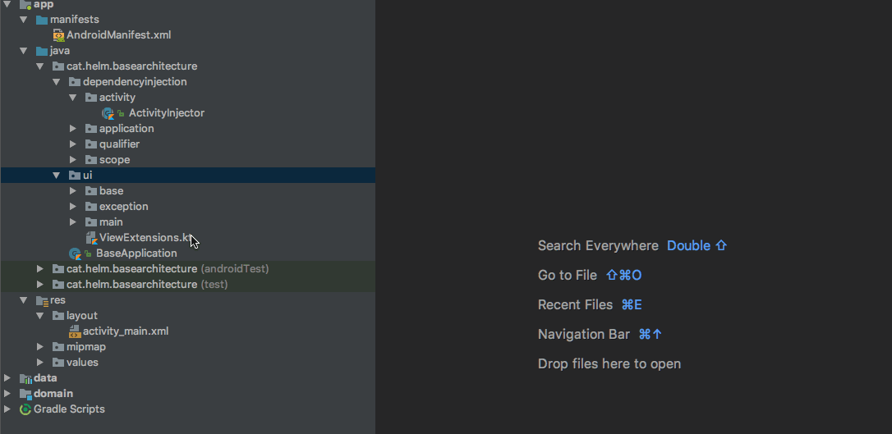

#Kotlin Clean Architecture plugin for Android Studio

This plugin automatizes the creation of boilerplate needed to develop Android applications using [our clean architecture approach](https://github.com/HelmMobile/KotlinCleanArchitecture).

##Features

- Creates and configures scene files
    - Activity
    - Presenter
    - View
    - Layout (Optional)
    - Dagger configuration (AndroidInjector)
    - Manifest activity entry

Refer to Roadmap to see what's next

##Usage

##Installation

This plugin is available in the [JetBrains Plugin Repository](https://plugins.jetbrains.com/plugin/10137-clean-architecture-templates)

Alternatively you can also download .zip in releases tab and install it manually through Preferences/Settings -> Plugins -> Install plugin from disk...`

##Road map

- Wizard with project creation
- Generate interactors
- Generate data sources
- Generate queries

##License

    Copyright 2017 Helm

    Licensed under the Apache License, Version 2.0 (the "License");
    you may not use this file except in compliance with the License.
    You may obtain a copy of the License at

       http://www.apache.org/licenses/LICENSE-2.0

    Unless required by applicable law or agreed to in writing, software
    distributed under the License is distributed on an "AS IS" BASIS,
    WITHOUT WARRANTIES OR CONDITIONS OF ANY KIND, either express or implied.
    See the License for the specific language governing permissions and
    limitations under the License.